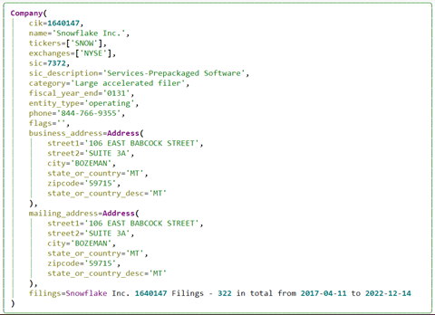

# edgar

[](https://pypi.org/project/edgar)
[](https://pypi.org/project/edgar)

-----

**Table of Contents**

- [Installation](#installation)
- [License](#license)

# Installation

```console
pip install edgar
```

# Usage


## Set your Edgar user identity

Before you can access the SEC Edgar API you need to set the identity that you will use to access Edgar.
This is usually your name and email, or a company name and email.
```bash
Sample Company Name AdminContact@<sample company domain>.com
```

The user identity is sent in the User-Agent string and the Edgar API will refuse to respond to your request without it.

EdgarTools will look for an environment variable called `EDGAR_IDENTITY` and use that in each request.
So, you need to set this environment variable before using it.
```bash
export EDGAR_IDENTITY="Michael Mccallum mcalum@gmail.com"
```
Alternatively, you can call `set_identity` which does the same thing.

```python
from edgar import set_identity
set_identity("Michael Mccallum mcalum@gmail.com")
```


For more detail see https://www.sec.gov/os/accessing-edgar-data

## Company API

With the company API you find a company using the **cik** or **ticker**. 
From the company you can access all their historical **filings**,
and a dataset of the company **facts**.
The SEC's company API also supplies a lot more details about a company including industry, the SEC filer type,
the mailing and business address and much more.

### Find a company using the cik
The **cik** is the id that uniquely identifies a company at the SEC.
It is a number, but is sometimes shown in SEC Edgar resources as a string padded with leading zero's.
For the edgar client API, just use the numbers and omit the leading zeroes.

```python
company = Company.for_cik(1318605)
```


### Find a company using ticker

You can get a company using a ticker e.g. **SNOW**. This will do a lookup for the company cik using the ticker, then load the company using the cik.
This makes it two calls versus one for the cik company lookup, but is sometimes more convenient since tickers are easier to remember that ciks.

Note that some companies have multiple tickers, so you technically cannot get SEC filings for a ticker.
You instead get the SEC filings for the company to which the ticker belongs.

The ticker is case-insensitive so you can use `Company.for_ticker("snow")`
or `Company.for_ticker("SNOW")`
```python
snow = Company.for_ticker("snow")
```


### 


```python
Company.for_cik(1832950)
```

### Get filings for a company
To get the company's filings use `get_filings()`. This gets all the company's filings that are available from the Edgar submissions endpoint.

```python
company.get_filings()
```
### Filtering filings
You can filter the company filings using a number of different parameters.

```python
class CompanyFilings:
    
    ...
    
    def get_filings(self,
                    *,
                    form: str | List = None,
                    accession_number: str | List = None,
                    file_number: str | List = None,
                    is_xbrl: bool = None,
                    is_inline_xbrl: bool = None
                    ):
        """
        Get the company's filings and optionally filter by multiple criteria
        :param form: The form as a string e.g. '10-K' or List of strings ['10-Q', '10-K']
        :param accession_number: The accession number that uniquely identifies an SEC filing e.g. 0001640147-22-000100
        :param file_number: The file number e.g. 001-39504
        :param is_xbrl: Whether the filing is xbrl
        :param is_inline_xbrl: Whether the filing is inline_xbrl
        :return: The CompanyFiling instance with the filings that match the filters
        """
```


#### The CompanyFilings class
The result of `get_filings()` is a `CompanyFilings` class. This class contains a pyarrow table with the filings
and provides convenient functions for working with filings.
You can access the underlying pyarrow `Table` using the `.data` property

```python
filings = company.get_filings()

# Get the underlying Table
data: pa.Table = filings.data
```

#### Get a filing by index
To access a filing in the CompanyFilings use the bracket `[]` notation e.g. `filings[2]`
```python
filings[2]
```

#### Get the latest filing

The `CompanyFilings` class has a `latest` function that will return the latest `Filing`. 
So, to get the latest **10-Q** filing, you do the following
```python
# Latest filing makes sense if you filter by form  type e.g. 10-Q
snow_10Qs = snow.get_filings(form='10-Q')
latest_10Q = snow_10Qs.latest()

# Or chain the function calls
snow.get_filings(form='10-Q').latest()
```


### Get company facts


## Filing API

```python
filings = get_filings(2021)
```


## License

`edgar` is distributed under the terms of the [MIT](https://spdx.org/licenses/MIT.html) license.
